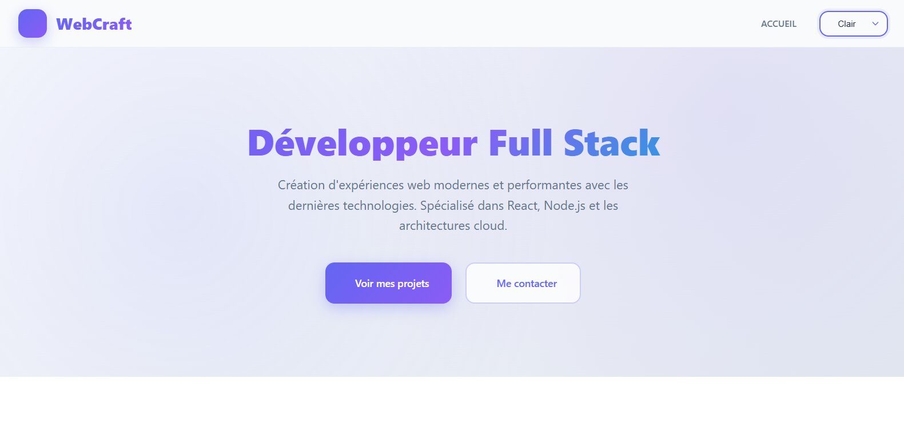
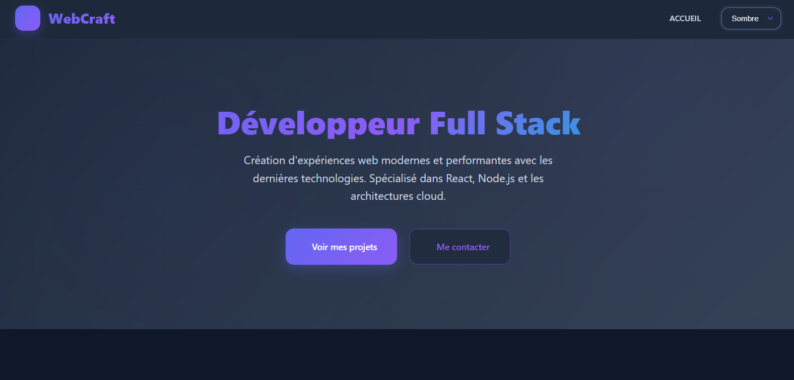

# 🌗 Dark Light Toggle

A sleek and responsive dark/light mode toggle built with **HTML**, **CSS**, and **JavaScript**.  
It provides users with an elegant way to switch themes while remembering their preferences across visits.

---

## 📸 Screenshots

### 🔆 Light Mode



### 🌙 Dark Mode



---

## 🚀 Features

- 🌗 Toggle between **Dark** and **Light** themes
- 💾 Saves user preference with `localStorage`
- 🎨 Smooth transitions between modes
- 💡 Easy to customize and integrate in any project
- ⚙️ Pure HTML, CSS, and Vanilla JS (no frameworks)

---

## 🛠️ Technologies Used

- **HTML5**
- **CSS3**
- **JavaScript (ES6)**

---

## 📂 Project Structure

```
dark-light-toggle/
│
├── dark-light-toggle.html            # Page principale avec le bouton de thème
│
├── css/
│   └── dark-light-toggle.css         # Styles pour les deux thèmes (light et dark)
│
├── js/
│   └── dark-light-toggle.js          # Logique JavaScript pour le basculement de thème
│
├── image/
│   ├── light-mode.png                # Capture d'écran du mode clair
│   └── dark-mode.png                 # Capture d'écran du mode sombre
│
└── README.md                         # Documentation professionnelle du projet
```
